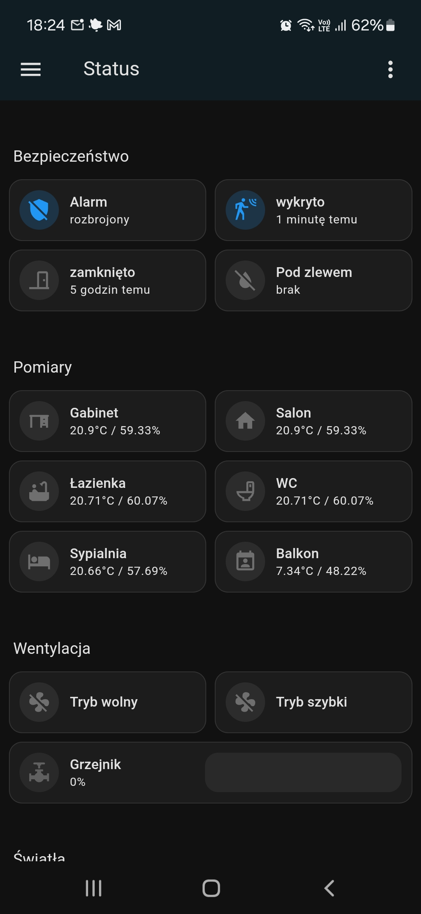
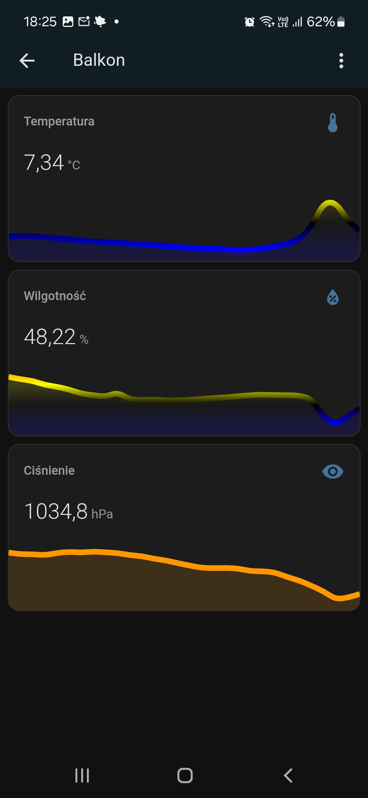
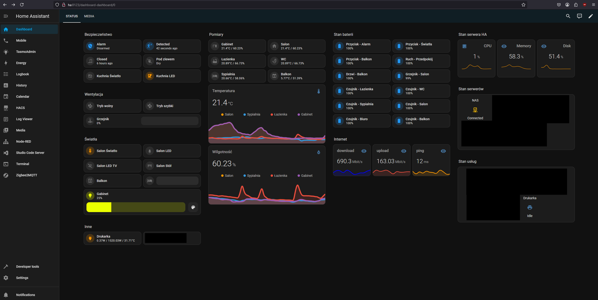
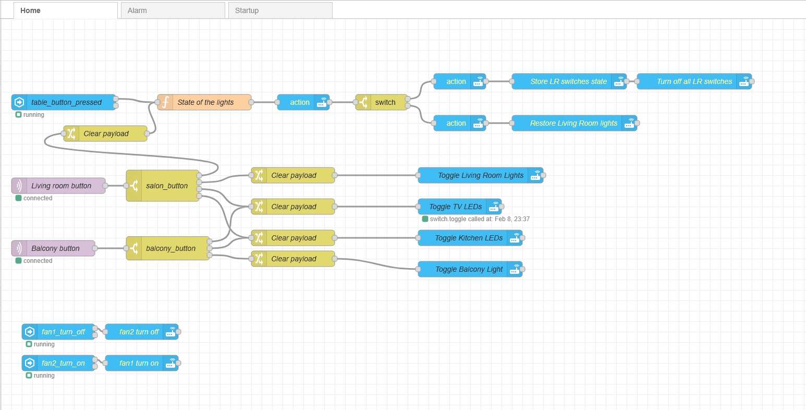
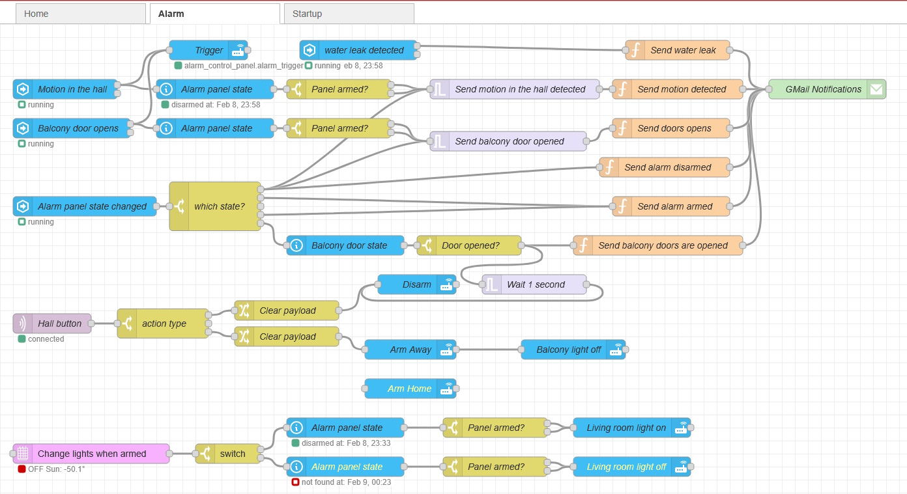

# Welcome to My Smart Apartment Page

Yes, I live in an apartment building, so it is not a smart house 😊. This is not a full code repository, just a few examples of how some things were implemented.

## My Goals
I created my smart apartment with two things in mind:
- Establishing a security system.
- Improving our quality of life.

## Infrastructure
- **Home Assistant** is the core of my smart system.
- All IoT devices use a **custom VLAN** for isolation. They only have access to Home Assistant and cannot communicate outside the VLAN, ensuring a **completely local setup**.
- **ZigBee** is used for most DC-powered sensors:
  - Initially, I used an older **Sonoff Zigbee coordinator** (flashed with Tasmota), but it frequently lost sensors.
  - I switched to **SLZB-06 Zigbee coordinator**, which has been more stable.
- **Wi-Fi IoT Network**:
  - Most AC-powered devices use a dedicated IoT Wi-Fi network.
  - Some devices run on **Tasmota firmware** to ensure local connectivity.
- **Communication Protocols**:
  - Most sensors communicate with Home Assistant via **MQTT**.
  - I recently switched from **ZHA to Zigbee2MQTT**.
  - Some devices also use **CoIoT** or **REST** protocols.
  - No **Matter over Thread** devices yet.

## Smart Features
### 1. Security
- I wanted **water leakage reports** and a **low-cost alarm system**.
- My alarm system consists of **strategically placed motion detectors** and **door sensors**.
- Alarm notifications are sent via **Gmail**.
- An automation simulates presence by randomly turning lights on and off after sundown when the alarm is armed.

### 2. Quality of Life Improvements
- **Lighting Control:**
  - All lights in the **living room, office, bathrooms, and bedroom** are managed via Home Assistant.
  - A **remote button** near the sofa can turn off all lights for movie time and restore them later.
- **Heating and Ventilation:**
  - The **living room heater** is remotely controlled (rarely use other heaters).
  - **Kitchen fans** are also remotely managed.
- **Environmental Monitoring:**
  - Temperature and humidity sensors are placed in all rooms, bathrooms, the balcony, and outdoors.
- **System Monitoring:**
  - Battery statuses and service states (NAS, printer, HA server, internet speed, etc.) are all visible on a central dashboard.

## Mobile Dashboard
Below is the dashboard as viewed on mobile devices:

When a room card is clicked, the user can see the **30-hour temperature, humidity, and pressure history** for that room.

## Admin Dashboard
Below is the dashboard as viewed by the admin on a PC:

## Home Automations
Below is the Node-RED flows for lights and alarm automations:

